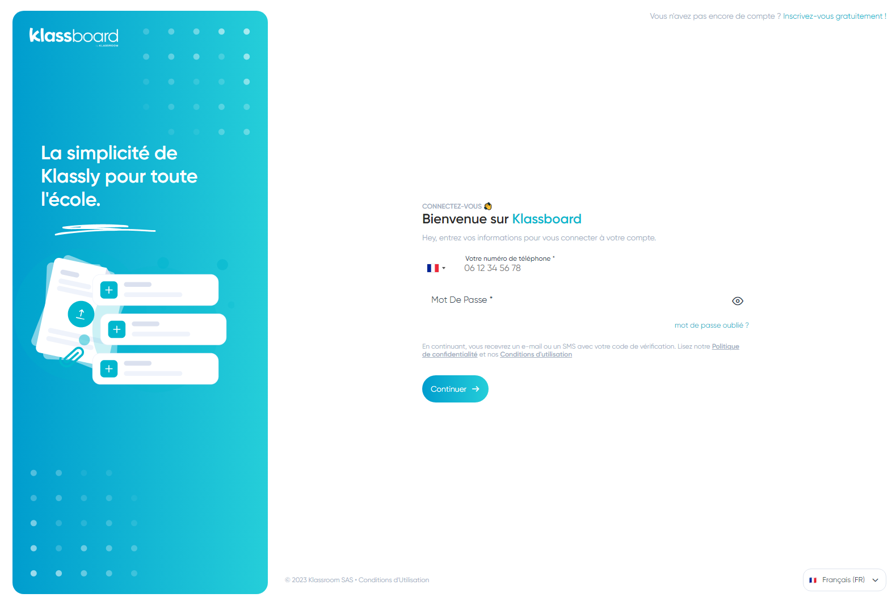

# Klassboard

This project is a application designed to facilitate communication between teachers, parents, and students in schools.

## Live Site

Check out the live site [https://klassboard.fr/](https://klassboard.fr/).

## Installation

To run this project locally, follow these steps:

1. Clone the repository onto your local machine.
2. Navigate to the project directory and run `npm install` to install all dependencies.
3. Run `npm start` to start the development server.
4. Open URL `http://localhost:3000/`.

